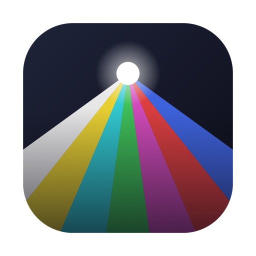

<div align="center">



# Pinhole

**A camera for the iOS Simulator, which has none.**

[](#requirements)
[](https://swift.org)
[](LICENSE)

</div>

---

Point your Mac's webcam — or a video file, a still, a QR code, or colour bars —
at any iOS app running in the Simulator. No paid Apple Developer account, no
system extension, no SIP changes.

## Why this exists

The Simulator exposes **no capture devices at all**. `AVCaptureDevice` discovery
returns an empty list, and the host Mac's webcam is not bridged into it.
Verified on Xcode 26.6 / iOS 26.5:

```
discovery count=0        # wideAngle, telephoto, ultraWide, dual, trueDepth, external, continuityCamera
default(.video)=nil
authStatus=3             # authorized — permission granted, still zero devices
```

That rules out every virtual-camera approach, macOS CMIO system extensions
included: even a loaded virtual camera is invisible to the Simulator. Frames
have to enter **inside** the app instead. That is what Pinhole does — a Mac-side
daemon serves JPEG frames over loopback, and a Swift package inside your app
turns them into real `CMSampleBuffer`s.

## Install

### Homebrew

```bash
brew tap FarhanFDjabari/pinhole https://github.com/FarhanFDjabari/Pinhole.git
brew trust --formula FarhanFDjabari/pinhole/pinhole
brew install pinhole
cp -R "$(brew --prefix pinhole)/Pinhole.app" /Applications/Pinhole.app
open -a Pinhole
```

Two of those need a word of explanation.

**`brew trust`** — Homebrew 6 will not load a formula from a tap outside
`Homebrew/*` until you grant it, because a formula is Ruby that runs on your
machine. Read [`Formula/pinhole.rb`](Formula/pinhole.rb) first; it is about
forty lines.

**`brew install` builds from source**, so it needs Xcode and takes roughly half
a minute. That is deliberate. Shipping a prebuilt app would mean a Homebrew
*cask*, and a downloaded ad-hoc-signed app is quarantined by macOS and rejected
by Gatekeeper — the only clean fix is notarization, which costs a paid Apple
Developer account this project does without. **A binary built on the machine it
runs on is never quarantined**, so building sidesteps the whole problem. Every
user of a tool for the iOS Simulator already has Xcode.

Homebrew keeps the app in its Cellar, which is not somewhere macOS looks for
applications, so the copy is what makes Pinhole a normal installed app.

**Copy, not symlink.** Spotlight indexes real bundles and does not index the
Cellar, so a symlinked app runs fine from `open -a Pinhole` but never appears in
the Spotlight menu.

The copy does not follow `brew upgrade`, so refresh it afterwards:

```bash
brew upgrade pinhole
rm -rf /Applications/Pinhole.app
cp -R "$(brew --prefix pinhole)/Pinhole.app" /Applications/Pinhole.app
```

To remove it entirely:

```bash
brew uninstall pinhole && rm -rf /Applications/Pinhole.app
```

### From source

```bash
git clone https://github.com/FarhanFDjabari/Pinhole.git
cd Pinhole
./scripts/build-menubar.sh
cp -R .build-dev/Pinhole.app /Applications/Pinhole.app
open -a Pinhole
```

The copy is a one-time step. Afterwards `build-menubar.sh` replaces the
installed copy on every run — the camera grant follows the code signature, not
the path, so it never re-prompts.

### First launch

The app starts its daemon immediately and defaults to your Mac's camera, so the
first launch asks for camera access. **Approve it.** If you miss the prompt:
System Settings → Privacy & Security → Camera → **Pinhole**.

## Quick start

**1. Install the menu bar app** — see [Install](#install) above.

**2. Confirm frames are going out.**

Menu bar icon → **Open Control Panel…**. A live preview of the outgoing feed
fills the top of the window. If it shows a picture, the Mac side is done.

**3. Add the package to your iOS project.**

Xcode → File → Add Package Dependencies → paste the repository URL:

```
https://github.com/FarhanFDjabari/Pinhole.git
```

Or in a `Package.swift` of your own:

```swift
.package(url: "https://github.com/FarhanFDjabari/Pinhole.git", from: "0.1.1")
```

Working on Pinhole itself? Use **Add Local…** and select the repository root —
the manifest lives there, not in `PinholeKit/`.

If your project has **several app targets**, link the package to *every* target
that compiles your source folders, not just one. Otherwise the other targets
compile the code and fail at the linker with undefined `PinholeKit` symbols.
Target → General → Frameworks, Libraries, and Embedded Content → **+**.

**4. Use it behind a Simulator guard.**

```swift
#if targetEnvironment(simulator)
import PinholeKit

let session = PinholeSession(source: .network(host: "127.0.0.1", port: 47009))
session.delegate = self
session.startRunning()
#endif
```

Device builds compile the guarded code away entirely and keep using
`AVCaptureSession`. Swap `.network` for `.testPattern` if you want frames
without running the Mac app at all.

## Using the app

Pinhole lives in the menu bar. The icon shows an aperture while the daemon runs
and a dotted circle when it is stopped.

**From the menu bar icon** — the headline line is `status · :port · N clients`,
which is the fastest way to tell whether your Simulator app actually connected.
Below it: start/stop, the source picker, frame rate, and **Copy
PINHOLE_SOURCE=network**.

**From the control panel** (menu bar → Open Control Panel…, or `⌘O`):

| Control | What it does |
|---|---|
| Preview | The real outgoing stream, with measured fps. The panel connects to the daemon as an ordinary client on the same socket the Simulator uses, so this is not a parallel rendering — if the preview is live, the wire is live |
| Source | Test Pattern, Mac Camera (with a picker when you have several), Video File, Image, and a QR payload field |
| Resolution / Frame rate | 640×360, 1280×720, 1920×1080 · 15, 24, 30, 60 fps |
| Run Diagnostics | Camera authorization, device list, port, client count, frames sent, and the daemon's path — paste this into bug reports |
| Refresh Cameras | Re-enumerates capture devices after plugging in a webcam |

Source, resolution and frame rate persist across launches. Changing any of them
restarts the daemon, which drops connected clients for a moment — `PinholeKit`
reconnects on its own within a second.

**Test Pattern is the source to reach for when something is wrong.** It needs no
camera and no permission, so if the pattern streams and your webcam does not,
the problem is the camera grant, not Pinhole.

Quitting the app stops the daemon. It also exits on its own if the app dies
without terminating it, so a crashed app never leaves port 47009 held.

## Sources

```swift
PinholeSession(source: .testPattern)                          // colour bars, moving sweep, frame counter
PinholeSession(source: .image(uiImage))                       // a still
PinholeSession(source: .qr("payload"))                        // generated QR code
PinholeSession(source: .video(url))                           // looped video file
PinholeSession(source: .network(host: "127.0.0.1", port: 47009))  // live, from Pinhole.app
```

`.testPattern`, `.image`, `.qr` and `.video` are self-contained — no daemon, no
permissions. `.network` is the live path and needs `Pinhole.app` running.

The Simulator shares the host's network stack, so `127.0.0.1` **is** the Mac.

## Consuming frames

All three capture styles are covered. Frames are always delivered on the main
actor, whichever thread the producer runs on.

```swift
// 1. Data-output delegate — the body of captureOutput(_:didOutput:from:) moves over unchanged
extension MyModel: PinholeSampleBufferDelegate {
    func pinhole(_ session: PinholeSession, didOutput sampleBuffer: CMSampleBuffer) {
        process(sampleBuffer)
    }
}

// 2. Preview — stands in for a view hosting AVCaptureVideoPreviewLayer
let preview = PinholePreviewView()
preview.videoGravity = .resizeAspectFill
preview.attach(to: session)

// 3. Photo capture
session.capturePhoto { image in self.imageView.image = image }
```

The delegate is `PinholeSampleBufferDelegate`, not
`AVCaptureVideoDataOutputSampleBufferDelegate`. `AVCaptureConnection` cannot be
constructed without real input ports, so the signature differs by design — only
the method signature, not the body.

## Choosing the source without recompiling

Read it from the environment and set `PINHOLE_SOURCE` on your scheme (Product →
Scheme → Edit Scheme → Run → Arguments → Environment Variables), then map the
string onto a `PinholeSource` in one small resolver of your own:

| Value | Feed |
|---|---|
| *(unset)* | test pattern |
| `qr:<payload>` | generated QR code |
| `image:<path>` | a still on disk |
| `video:<path>` | looped video |
| `network` | live, from `Pinhole.app` |
| `network:<host>:<port>` | live, non-default address |

**Running `Pinhole.app` is not enough on its own** — without `PINHOLE_SOURCE`
your app still asks for the default feed and you get colour bars.

## The daemon by hand

The menu bar app is a front end for `pinholed`, which also runs standalone:

```bash
./scripts/build-pinholed.sh
.build-dev/pinholed                     # default webcam, 1280x720, 30fps
.build-dev/pinholed --pattern           # colour bars, no camera needed
.build-dev/pinholed --qr "hello"        # generated QR code
.build-dev/pinholed --list              # available capture devices
.build-dev/pinholed --device "FaceTime" # pick one by name
.build-dev/pinholed --file ~/clip.mov   # loop a video
.build-dev/pinholed --image ~/plate.png # a still
.build-dev/pinholed --fps 15 --width 640 --height 360 --quality 0.5
```

Prefer the menu bar app for camera work. A bare CLI tool has no TCC identity of
its own, so macOS attributes its camera access to whichever terminal launched it
— awkward to grant, and impossible to reset with
`tccutil reset Camera <bundle-id>` because there is no bundle. `Pinhole.app` runs
the same binary as its child, so the grant lands on the app.
`tccutil reset Camera com.local.pinhole` works.

## Wire format

Length-prefixed JPEG frames, little-endian, 28-byte header
(`PinholeWire.swift`, compiled into both sides):

```
 0  magic      UInt32   'PHF1'
 4  payloadLen UInt32
 8  width      UInt32
12  height     UInt32
16  timestamp  Float64  seconds from stream start
24  format     UInt8    0 = JPEG
25  reserved   3 bytes
28  payload
```

720p at 30fps is roughly 2.5 MB/s over loopback.

## Layout

| Path | What it is |
|---|---|
| `Formula/pinhole.rb` | Homebrew formula, so the repo doubles as its own tap |
| `Package.swift` | Package manifest. At the root because SwiftPM resolves a remote package only from the repository root |
| `PinholeKit/` | Sources of the Swift package you add to your iOS app — vends `CMSampleBuffer`s from a chosen source |
| `pinholed/` | macOS CLI that captures the Mac's webcam (or a file) and serves JPEG frames over TCP |
| `PinholeMenuBar/` | Menu bar app wrapping the daemon — control panel with live preview, source picker, diagnostics |
| `scripts/` | `build-pinholed.sh`, `build-menubar.sh`, `make-icon.sh` |

The app icon is generated, not hand-drawn: `scripts/make-icon.sh` renders
`PinholeMenuBar/Pinhole.icns` and `assets/icon.png` from `make-icon.swift` — a
bright aperture throwing the test pattern's colour bars as a cone of light. Both
outputs are checked in, so an ordinary build never runs it.

## Requirements

macOS 14+ to run the daemon and menu bar app, iOS 15+ for `PinholeKit`, and
Xcode with both SDKs. Nothing here needs a paid Apple Developer account, a
system extension, or SIP disabled.

## Troubleshooting

| Symptom | Cause |
|---|---|
| Colour bars with a counter, not your webcam | `PINHOLE_SOURCE` is unset — the default is the test pattern |
| `camera access denied`, daemon exits at once | Grant camera to **Pinhole** in System Settings → Privacy & Security → Camera. Reset with `tccutil reset Camera com.local.pinhole` |
| `No such bundle identifier "com.local.pinholed"` | Expected — the CLI is not a bundle. Use the menu bar app |
| Undefined `PinholeKit` symbols at link time | Package not linked to *that* app target |
| `failed to listen on port 47009` | Another `pinholed` is already running — quit it, or the app's copy |
| `unable to resolve module dependency` after project edits | `xcodebuild -resolvePackageDependencies`, or Xcode → File → Packages → Resolve Package Versions |
| Menu says `0 clients` while the app runs | The app is on a non-`network` source, or connected before the daemon started — it retries every second |
| Spotlight cannot find Pinhole after a Homebrew install | `/Applications/Pinhole.app` is a symlink. Spotlight does not index symlinks or the Cellar — replace it with a copy: `rm -f /Applications/Pinhole.app && cp -R "$(brew --prefix pinhole)/Pinhole.app" /Applications/Pinhole.app` |

## Credit — and why this exists separately

Pinhole grew out of an attempt to use
[**SimulatorCamera** by Ruslan Dautov](https://github.com/dautovri/SimulatorCamera)
(MIT). Its design goal is the better one, and its UI is the model this app's
control panel follows — source picker, activation status, diagnostics, frame
counter. Credit for the feature surface and for framing the problem goes there.

We could not use it, for two reasons stacked on top of each other.

**1. The signing wall.** SimulatorCamera ships a CMIOExtension, which needs the
restricted entitlement `com.apple.developer.system-extension.install`. Apple
only issues provisioning profiles carrying that capability to **paid** Developer
Program teams. Ad-hoc signing applies the entitlement but AMFI rejects it at
`posix_spawn` — the container app is killed before `main` runs:

```
Launch failed. NSPOSIXErrorDomain Code=163 "Launchd job spawn failed"
```

Strip the entitlement and the same binary launches fine, which isolates the
cause. The only workarounds are a paid team, or disabling SIP — and on Apple
Silicon SIP lives in the LocalPolicy boot object, so changing it means a
recoveryOS trip and a machine-wide security downgrade.

**2. The fatal one.** Even with the extension loaded, the iOS Simulator would
not see it. The Simulator enumerates **zero** capture devices — a virtual camera
is invisible to it exactly as the host's real webcam is. So SimulatorCamera's
headline promise, *no `#if` guards anywhere in your consuming app's code*, is
not achievable in the Simulator by any project taking that route. Frames have to
be injected inside the app process. That is the cost Pinhole pays, and the
reason it exists as a separate thing rather than a patch.

No code was copied. The wire format, daemon, package and UI here are written
from scratch; what carried over is the idea of a Mac-side app with switchable
sources, and which sources are worth having.

### How they differ

| | SimulatorCamera | Pinhole |
|---|---|---|
| Mechanism | CMIOExtension registers a virtual camera with macOS | TCP feed + in-app Swift package |
| App-side code changes | none (the goal) | a `#if targetEnvironment(simulator)` shim |
| Paid Apple Developer account | required | not needed |
| SIP disabled | required for local dev | not needed |
| Consumer API | stock `AVCaptureDevice` | `PinholeSession` |
| Works in the iOS Simulator | no | yes |
| Works for a **macOS** app or Zoom/Meet | yes — a real system camera | no |

That last row is worth keeping in mind: if you ever need a virtual camera for
*macOS* apps rather than the Simulator, SimulatorCamera's approach is the right
one and Pinhole is not a substitute.

### Feature parity

Everything of SimulatorCamera's surface that still means something without a
system extension:

| SimulatorCamera | Pinhole |
|---|---|
| Test pattern | ✅ `--pattern`, and `.testPattern` in the package |
| Mac camera | ✅ `--device`, live over the socket |
| Video file | ✅ `--file`, looped |
| Image | ✅ `--image` |
| QR code with editable payload | ✅ `--qr`, payload field in the control panel |
| Frame counter | ✅ frames sent, plus measured fps |
| Run Diagnostics | ✅ Run Diagnostics — camera authorization, devices, port, clients, binary path |
| Extension activation status | ✗ nothing to activate — replaced by daemon status and client count |
| `simcamctl` control CLI | ✗ superseded by `pinholed`'s own flags |
| — | ➕ **live preview** of the outgoing feed (SimulatorCamera has no preview) |
| — | ➕ resolution and frame-rate switching |

## Scope

Development tooling. Ad-hoc signed, not notarized, no tests, and deliberately
not a product — `PinholeKit` only ever runs behind
`#if targetEnvironment(simulator)`, and nothing here ships in a device build.

## Contributing

See [CONTRIBUTING.md](CONTRIBUTING.md).

## License

MIT — see [LICENSE](LICENSE).
